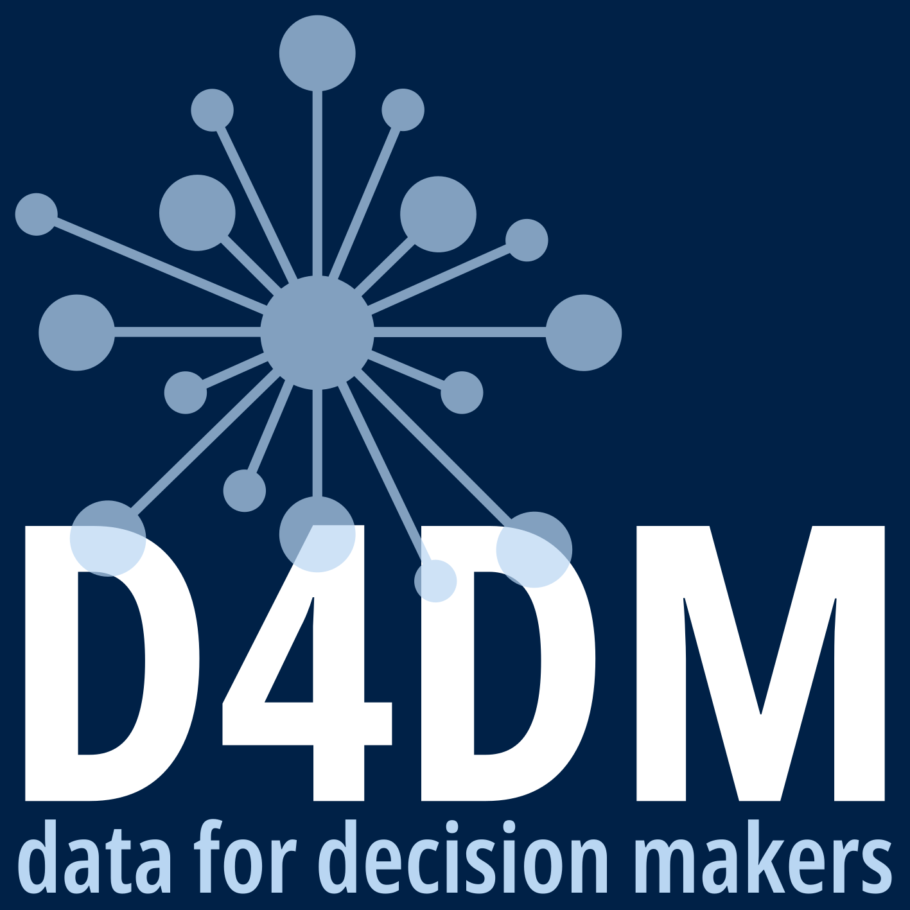

# dolt: git for data 

 

[-GPL3.0-blue)](https://opensource.org/licenses/gpl-3.0.html) [-CC_BY_4.0-blue)](https://creativecommons.org/licenses/by/4.0/)

This is an [R](https://www.r-project.org/)-based and [Quarto](https://quarto.org/)-powered repository containing source code for the Revealjs presentation developed and presented for the Digital Research Academy Train-the-Trainer didactics session on the 17th of March 2026.

