## Learning outcomes

At the end of this session, participants should be able to:

* describe the similarities between `git` and `dolt` and `GitHub` and `DoltHub`

* use concepts of `dolt`-based version control of data in relation to `git`-based version control of code

* identify the advantages and limitations of using `dolt` and `DoltHub` for version control of data

* describe some relevant use cases for `dolt` and `DoltHub` for version control of data

## Session outline

1. What is `dolt` and `DotHub`

3. Demonstration: How to initiate and manage a version-controlled database using `dolt` and `DoltHub`

4. Use cases for version-controlled database using `dolt` and `DoltHub`

## What is `dolt` and `DoltHub` {background-color="#002147" .center}

## `dolt` {.center}

:::: {.columns}

::: {.column width="50%"}

* an SQL database that can be forked, cloned, branched, merged, pushed, and pulled just like a `git` repository

:::

::: {.column width="50%"}

{fig-align="center"}

:::

::::

## `DoltHub` {.center}

:::: {.columns}

::: {.column width="50%"}

{fig-align="center"}

:::

::: {.column width="50%"}

* a place to share `dolt` databases

* public data are hosted for free

* adds a modern, secure, always on database management web GUI to the `dolt` ecosystem.

:::

::::

## `dolt` is to `DoltHub` as `git` is to `GitHub` {.center}

## Creating and managing a version-controlled database using `DoltHub` {background-color="#002147" .center}

## Create and login to your `DoltHub` account {.center}

## Go to the *Databases* tab and click on *Create Database* button {.center}

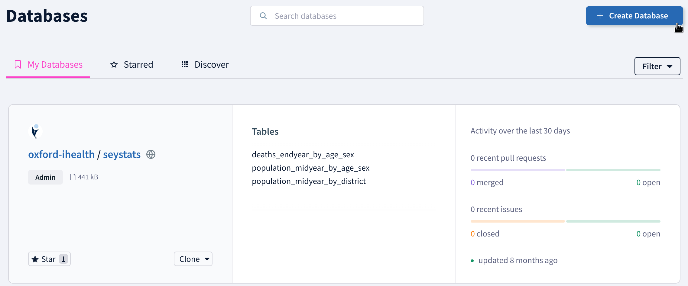{fig-align="center"}

## Give the database a name and a description and then create database {.center}

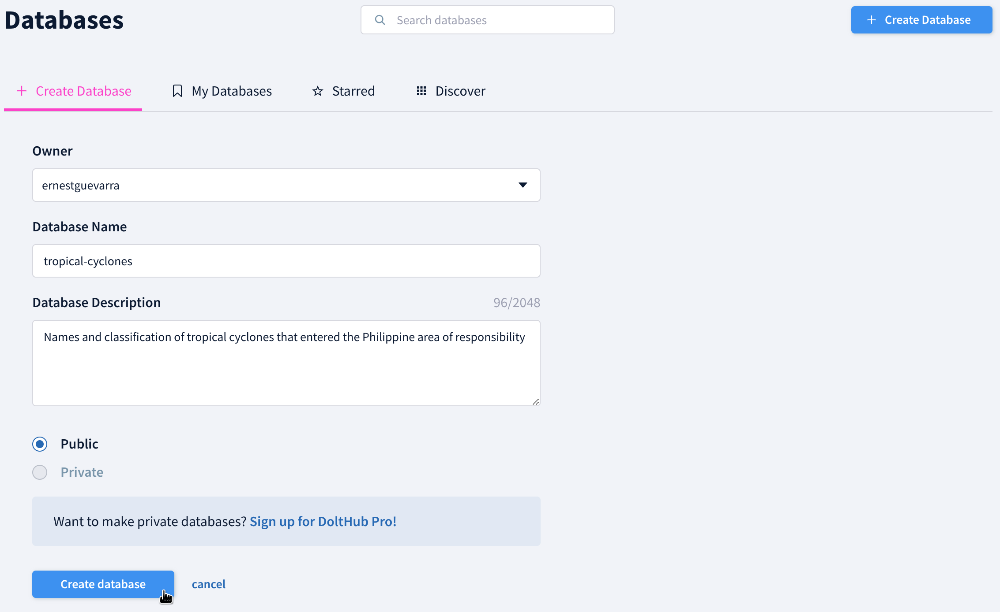{fig-align="center"}

## Click on *File upload* option {.center}

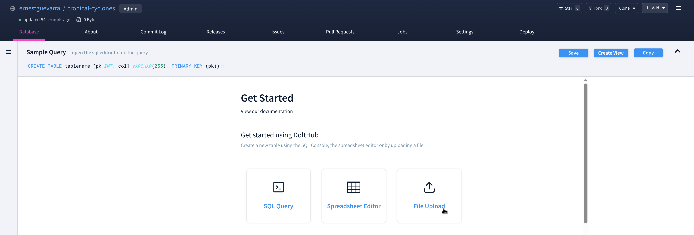{fig-align="center"}

## Give the new table a name {.center}

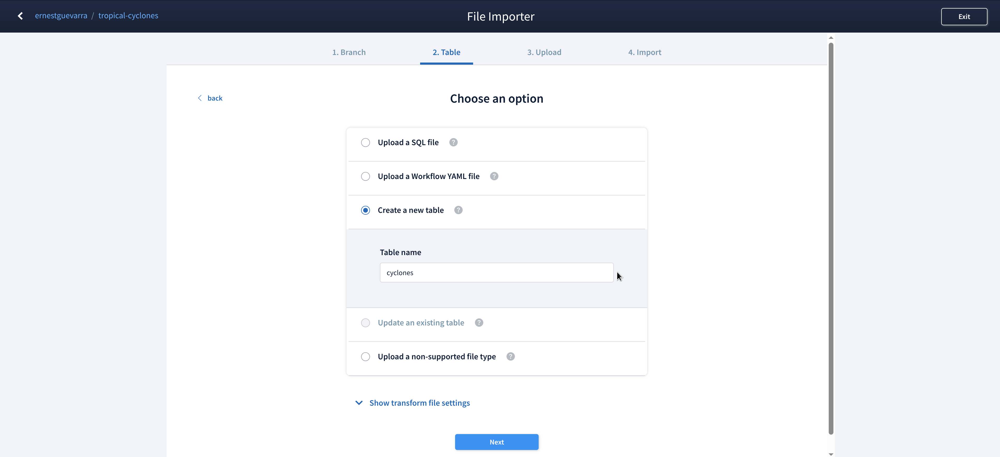{fig-align="center"}

## Click on *Browse files* and then select the data to upload {.center}

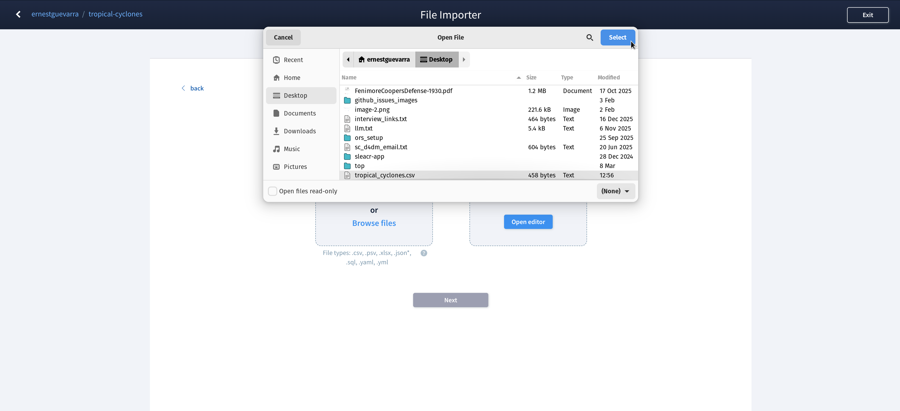{fig-align="center"}

## Choose primary keys for the table you uploaded {.center}

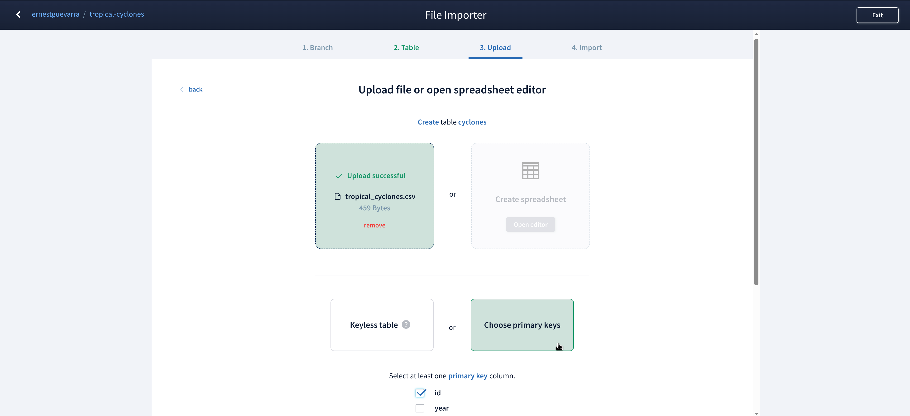{fig-align="center"}

## Add a commit message and specify a branch (optional) {.center}

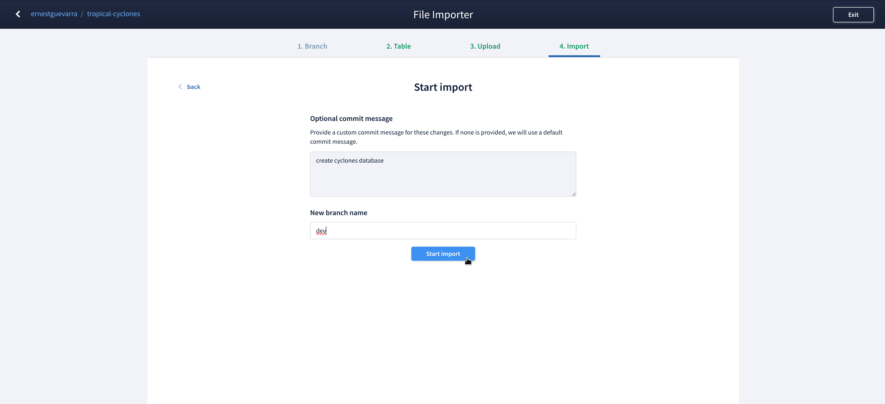{fig-align="center"}

## {.center}

:::: {.columns}

::: {.column width="50%"}

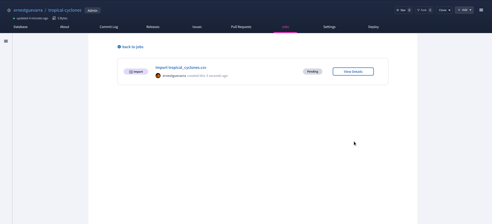{fig-align="center"}

:::

::: {.column width="50%"}

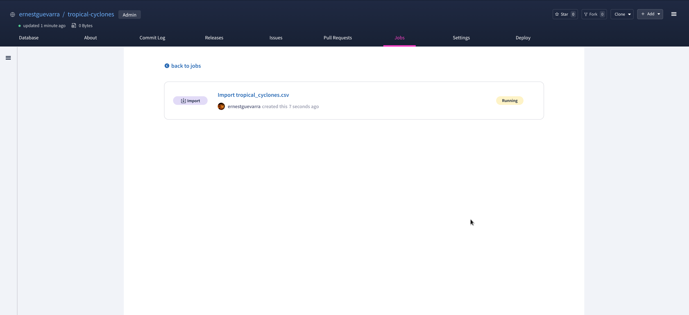{fig-align="center"}

:::

::::

:::: {.columns}

::: {.column width="50%"}

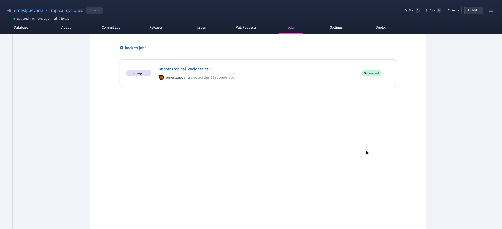{fig-align="center"}

:::

::: {.column width="50%"}

:::

::::

## Review pull request and merge {.center}

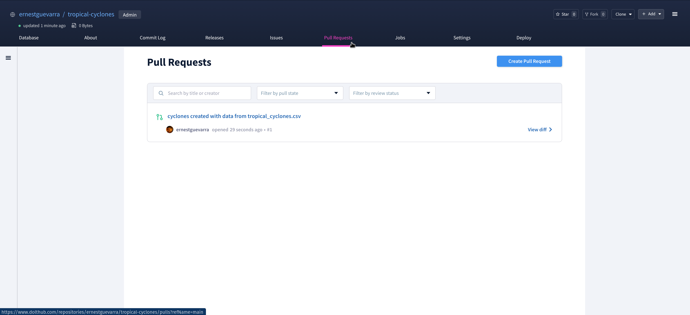{fig-align="center"}

## {.center}

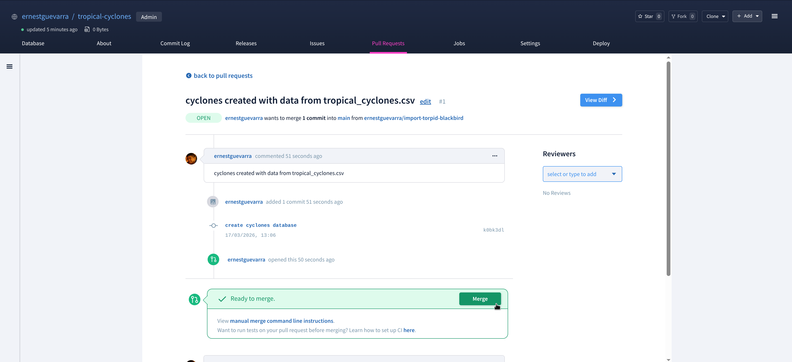{fig-align="center"}

## Database is now created in main branch ... {.center}

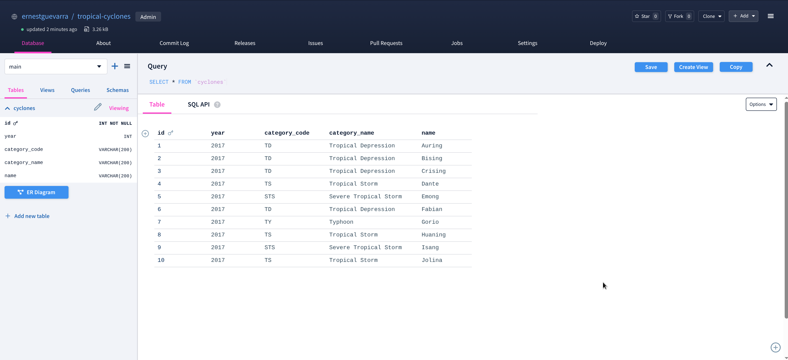{fig-align="center"}

## ... and it is the same as in dev branch {.center}

{fig-align="center"}

## Making versioned changes to the database {background-color="#002147" .center}

## On `dev` branch, add a new row of data to the cyclones table {.center}

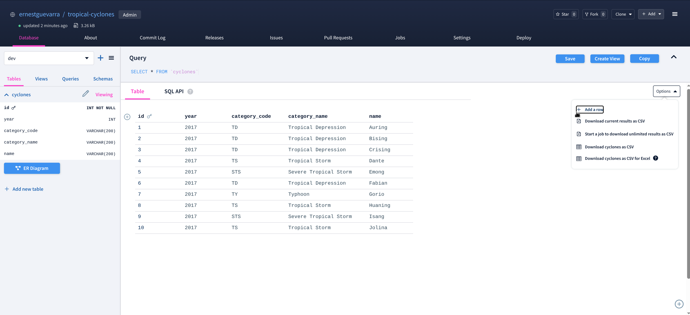{fig-align="center"}

## {.center}

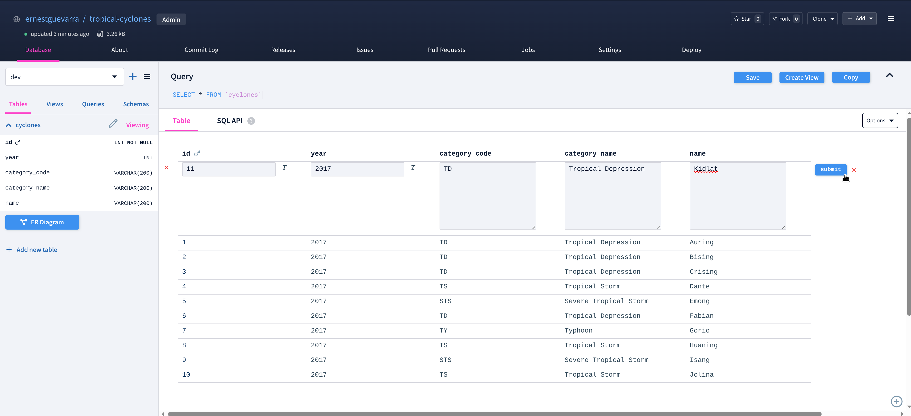{fig-align="center"}

## Create a pull request from `dev` to `main` with the new row of data {.center}

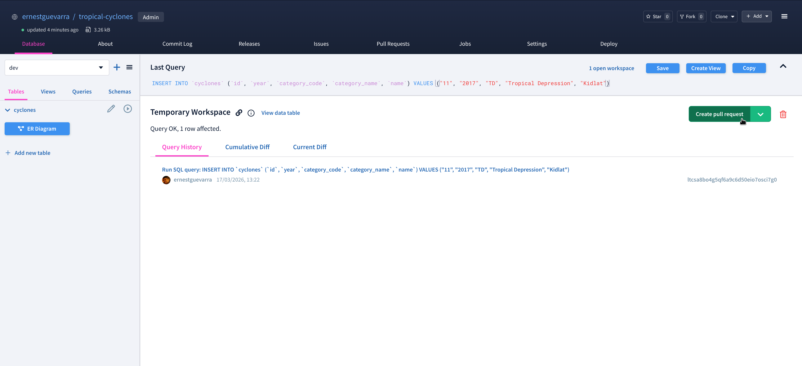{fig-align="center"}

## {.center}

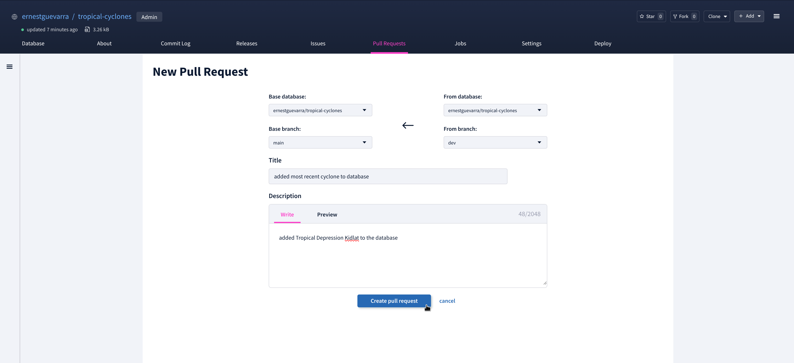{fig-align="center"}

## Select a reviewer of the pull request {.center}

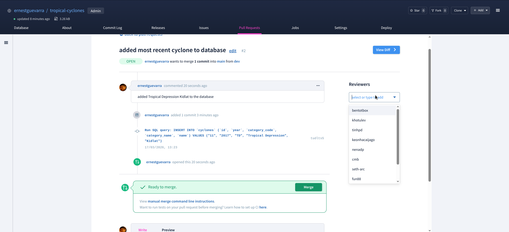{fig-align="center"}

## Review the changes proposed by the pull request {.center}

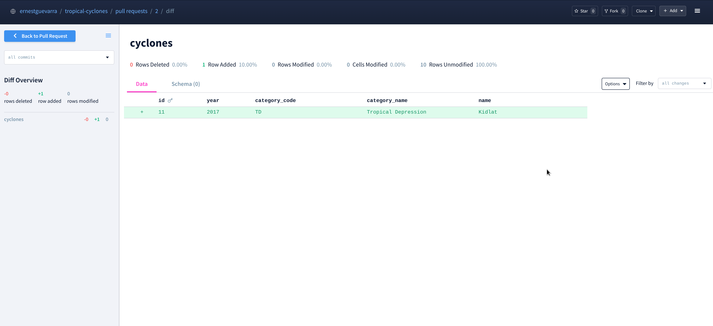{fig-align="center"}

## Merge pull request to `main` {.center}

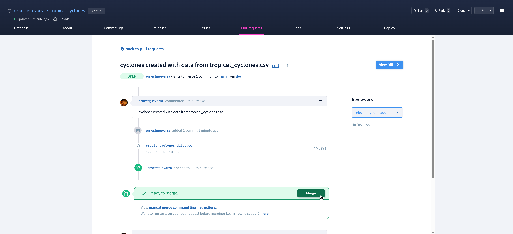{fig-align="center"}

## New row of data is now on `main` {.center}

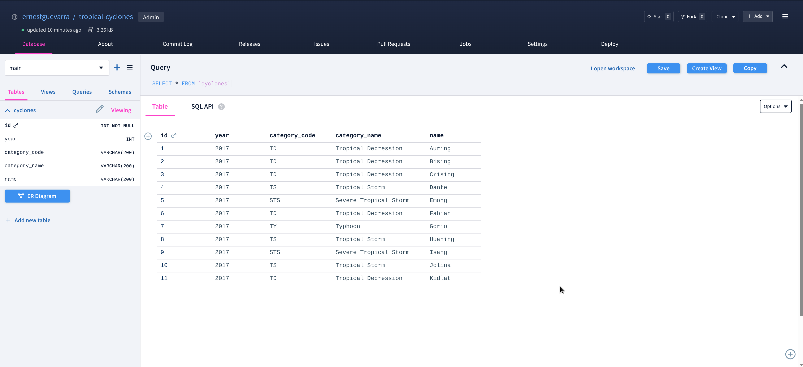{fig-align="center"}

## Use cases {background-color="#002147" .center}

* Data collaboration and curation on `DoltHub`

* Distributing versioned data through `dolt` as an alternative to APIs

* Data model quality control and versioning

## What questions do you have? {background-color="#002147" .center}

## Thank you! {background-color="#002147" .center}

* Slides can be viewed at [https://d4dm.org/dolt-git-for-data](https://d4dm.org/dolt-git-for-data)

* PDF version of slides can be downloaded at [https://d4dm.org/dolt-git-for-data.pdf](https://d4dm.org/dolt-git-for-data.pdf)

* R scripts for slides available at [https://github.com/data4decisionmakers/dolt-git-for-data](https://github.com/data4decisionmakers/dolt-git-for-data)

[-GPL3.0-blue)](https://opensource.org/licenses/gpl-3.0.html) [-CC_BY_4.0-blue)](https://creativecommons.org/licenses/by/4.0/)